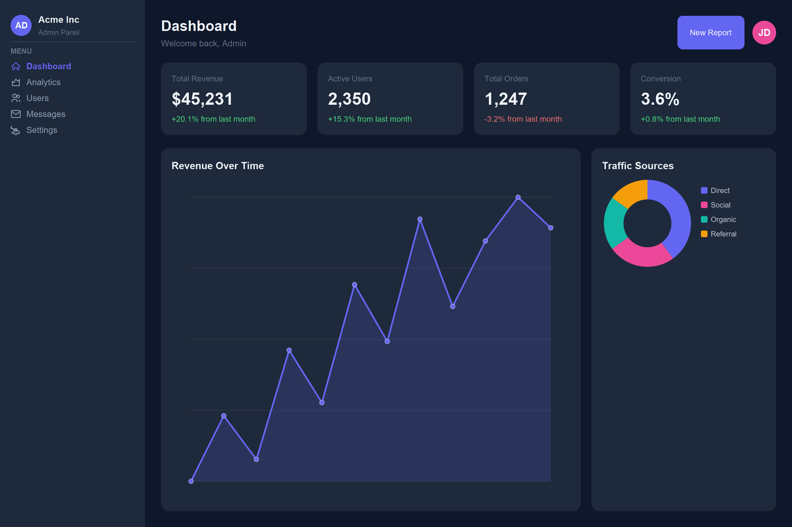
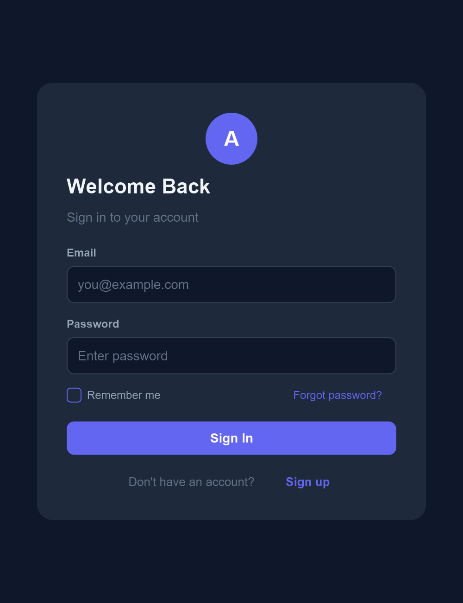
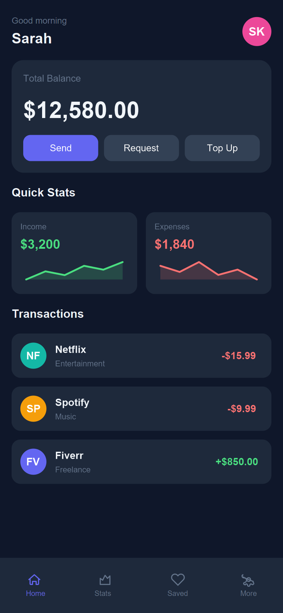
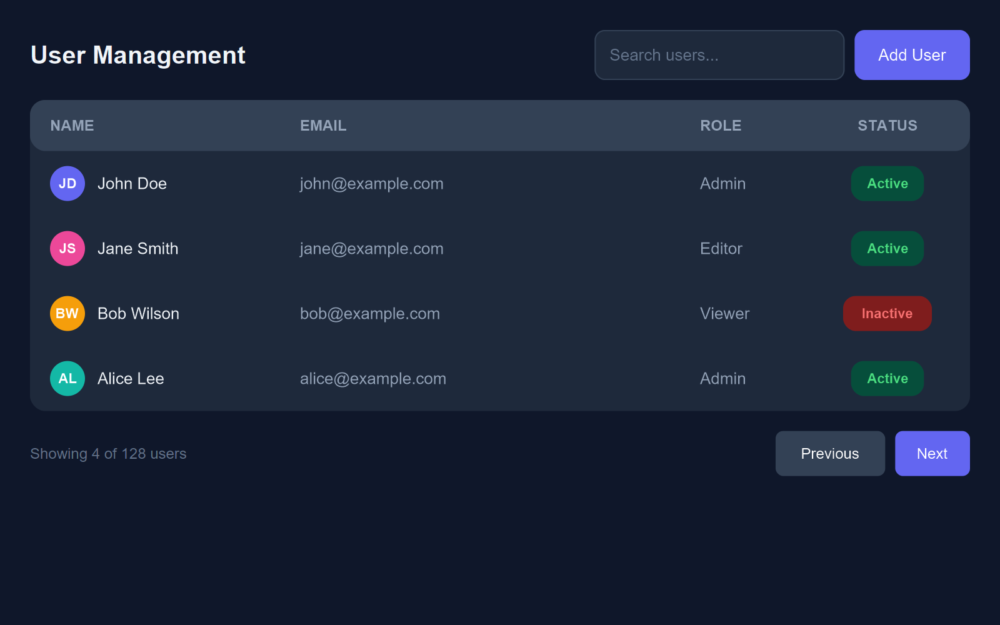

# LMF — LLM Markup Format

A text-based image format that any LLM can read, write, and understand — no vision required.

## The Problem

Every image format created for humans (PNG, JPG, SVG, WebP) encodes **pixels or paths** — data that text-only LLMs cannot interpret. An LLM reading a PNG sees meaningless bytes. Even vision-capable LLMs can only *look at* images, not *reason about* or *edit* their structure.

## The Solution

LMF encodes **semantic visual structure** as ultra-compact text. A `.lmf` file IS the image — any LLM can read it and instantly understand the layout, colors, hierarchy, typography, and data. A companion renderer converts `.lmf` to PNG, SVG, or HTML for human viewing.

```
#LMF1 400x200 bg:#0f172a
C w:f h:f al:center jc:center p:24
  T s:24 b c:#fff "Hello, World!"
  T s:14 c:#64748b "Rendered from 3 lines of LMF"
```

## Token Efficiency

| Example               | LMF Tokens | Equivalent HTML+CSS |
|-----------------------|------------|---------------------|
| Admin Dashboard       | ~500       | ~5,000+             |
| Login Page            | ~200       | ~2,000+             |
| Mobile Finance App    | ~500       | ~4,000+             |
| User Management Table | ~460       | ~3,500+             |

A full admin dashboard in **~500 tokens** — 10x more compact than HTML.

## Quick Start

```bash
# SVG or HTML output — no dependencies
python lmf.py render examples/dashboard.lmf -o dashboard.svg
python lmf.py render examples/dashboard.lmf -o dashboard.html

# PNG output — requires cairosvg
pip install cairosvg
python lmf.py render examples/dashboard.lmf -o dashboard.png --scale 2
```

### All Commands

```bash
python lmf.py render <file.lmf> -o <output.svg>    # Vector image (no deps)
python lmf.py render <file.lmf> -o <output.html>   # Open in browser (no deps)
python lmf.py render <file.lmf> -o <output.png>    # Raster PNG (needs cairosvg)
python lmf.py render <file.lmf> -o <output.png> --scale 2   # 2x resolution
python lmf.py validate <file.lmf>                  # Check syntax
python lmf.py version                              # Show version
```

## Examples

### Admin Dashboard (~500 tokens)


### Login Page (~200 tokens)


### Mobile Finance App (~500 tokens)


### User Management Table (~460 tokens)


## Format Overview

LMF uses **indentation-based nesting** (like Python) and **short property keys** to minimize tokens.

```
#LMF1 1200x800 bg:#0f172a      ← header: version, canvas size, background

R w:f h:f                       ← Row (horizontal flex container)
  C w:250 bg:#1e293b p:16       ← Column, 250px wide, dark bg, 16px padding
    T s:20 b c:#fff "Sidebar"   ← Text, 20px bold white
    Dv c:#334155                 ← Divider line
  C w:f p:24 g:16               ← Column, flex width, 24px pad, 16px gap
    T s:28 b c:#fff "Dashboard"
    R g:16 w:f                  ← Row with 16px gap
      C w:f bg:#1e293b r:12 p:16
        T s:12 c:#888 "Revenue"
        T s:28 b c:#fff "$45K"
```

### Node Types

| Type | Name     | Description                   |
|------|----------|-------------------------------|
| `R`  | Row      | Horizontal flex container     |
| `C`  | Column   | Vertical flex container       |
| `T`  | Text     | Text with font/color/size     |
| `Ch` | Chart    | Line, bar, pie, donut, area, spark |
| `Bt` | Button   | Styled button                 |
| `In` | Input    | Input field                   |
| `Av` | Avatar   | Circular avatar with initials |
| `Bd` | Badge    | Small colored badge/tag       |
| `Ic` | Icon     | Named icon glyph              |
| `Dv` | Divider  | Horizontal line               |
| `Pg` | Progress | Progress bar                  |
| `Im` | Image    | Placeholder image             |
| `B`  | Box      | Generic container             |

### Key Properties

| Prop  | Meaning          | Example                        |
|-------|------------------|--------------------------------|
| `w`   | Width            | `w:250`, `w:f` (flex), `w:50%` |
| `h`   | Height           | `h:400`, `h:f` (flex)          |
| `p`   | Padding          | `p:16`, `p:16,8` (v,h)         |
| `g`   | Gap              | `g:12`                         |
| `bg`  | Background color | `bg:#1e293b`                   |
| `c`   | Text/icon color  | `c:#fff`                       |
| `s`   | Font/icon size   | `s:24`                         |
| `b`   | Bold             | `b` (flag, no value)           |
| `r`   | Border radius    | `r:12`                         |
| `al`  | Align items      | `al:center`                    |
| `jc`  | Justify content  | `jc:between`                   |
| `bd`  | Border           | `bd:1,#334155`                 |
| `sh`  | Shadow           | `sh:sm`, `sh:lg`               |

### Layout Model

LMF uses simplified **flexbox**:
- `R` lays out children **horizontally**, `C` lays out children **vertically**
- `w:f` / `h:f` = flex-grow (take remaining space)
- Fixed sizes in px or percentages
- `g` controls gap between children
- `al` / `jc` control alignment and justification

### Charts

```
Ch type:area d:30,45,35,60,48,75 c:#6366f1 h:f w:f
Ch type:bar  d:40,60,35,80,55    colors:#6366f1,#ec4899 l:Mon,Tue,Wed,Thu,Fri
Ch type:donut d:40,25,20,15      colors:#6366f1,#ec4899,#14b8a6,#f59e0b l:A,B,C,D
Ch type:spark d:20,35,28,45,38   c:#4ade80 h:40 w:f
```

| Chart Type | Description            |
|------------|------------------------|
| `line`     | Line chart with dots   |
| `area`     | Filled area chart      |
| `spark`    | Compact sparkline      |
| `bar`      | Vertical bar chart     |
| `pie`      | Pie chart              |
| `donut`    | Donut chart            |

### Icons

Icons are referenced by name. Available icons:

`home` `chart` `users` `settings` `bell` `search` `mail` `star` `heart`
`check` `x` `plus` `arrow-left` `arrow-right` `menu` `folder` `file`
`clock` `eye` `edit` `trash` `download` `lock` `globe` `calendar` `phone`

```
Ic name:home s:20 c:#6366f1
```

### Macros

Define reusable aliases to reduce repetition:

```
@def Card C bg:#1e293b r:12 p:16 sh:sm

Card w:f g:8
  T s:12 c:#888 "Revenue"
  T s:28 b c:#fff "$45K"
```

## Architecture

```
.lmf source
    │
    ▼
Parser  (indentation-based, macro expansion)
    │
    ▼
SVG Layout Engine  (pure Python flexbox implementation)
    │
    ├──► .svg  (vector, no dependencies)
    ├──► .html (browser CSS flexbox, no dependencies)
    └──► .png  (via cairosvg, pip install cairosvg)
```

The renderer implements a two-pass flexbox layout engine in pure Python:
- **Pass 1** — measure natural sizes of fixed/content-sized children
- **Pass 2** — distribute remaining space to flex children, then position all children

## Why This Matters for LLMs

1. **Text-only LLMs can "see"** — any LLM can read a `.lmf` file and understand the UI
2. **LLMs can author UIs** — generate complete layouts in ~200–500 tokens
3. **LLMs can edit precisely** — change a color, move a component, update data — all as text edits
4. **LLMs can reason about layout** — the structure is semantic, not pixel-based
5. **Inter-convertible** — render to PNG/SVG/HTML for human viewing

## Dependencies

| Output | Dependencies |
|--------|-------------|
| `.svg` | None (stdlib only) |
| `.html` | None (stdlib only) |
| `.png` | `pip install cairosvg` |

## Full Specification

See [SPEC.md](SPEC.md) for the complete format specification.
